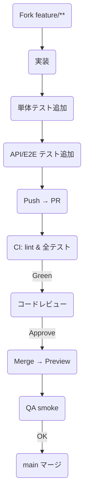

# QRオーダー & 会計連携システム  
## **実装計画書** ― *v 2025-04-28 (Rev 1)*  
> 対象：詳細設計書 *Rev 6.2* に基づく実装フェーズ  
> 方針：**「機能を実装したら直後にテストコードをコミット」** を徹底し、CI パイプラインで順次自動検証する。  

---

## 1. 開発モデル概要

| 項目 | 採用方針 |
| :-- | :-- |
| **リポジトリ** | GitHub (monorepo) |
| **ブランチ運用** |  1. `main` … 常時デプロイ可能 2. `dev` … スプリント統合 (週次) 3. `feature/**` … 1 Issue = 1 PR |
| **コード規約** | ESLint + Prettier + Husky pre-commit |
| **CI** | GitHub Actions (lint → unit → api → e2e smoke) |
| **CD** | Vercel Preview (自動) → `main` マージで Prod |
| **テスト必須化** | **PR が通る条件** ‐ *新規／変更コード* に対応するテストが追加されている ‐ カバレッジ差分が低下しない |

---

## 2. 役割分担

| ロール | 主担当 | 備考 |
| :-- | :-- | :-- |
| **Tech Lead** | 加藤さん | レビュー方針／CI 設計 |
| **Backend** | A さん | Supabase SQL & Route Handlers |
| **Frontend** | B さん | RSC / Portal & Menu UI |
| **QA** | C さん | Playwright シナリオ／負荷試験 |
| **DevOps** | D さん | GitHub Actions / Vercel 環境 |

---

## 3. スプリント予定 (2 週間＝10 営業日)

| Sprint | 主要成果物 | 日程 | 完了判定 |
| :-: | :-- | :-- | :-- |
| **S0** | 開発環境セットアップ CI / lint / test 雛形 | 4-28 – 5-02 | `main` に CI グリーン |
| **S1** | ⚙️ **Auth & RLS 基盤**  `/login/{store_code}` 画面 | 5-05 – 5-16 | QA: RLS 403/200 テスト完 |
| **S2** | 🪑 **テーブル CRUD + QR** (`/portal/tables`) | 5-19 – 5-30 | QR 画像生成 E2E 通過 |
| **S3** | 🍣 **QRメニュー v1** (`/menu/[table]`)  オフライン閲覧 | 6-02 – 6-13 | Workbox offline test |
| **S4** | 📦 **注文フロー & Kanban** | 6-16 – 6-27 | 2 ブラウザ同期 < 1 s |
| **S5** | 💰 **チャージ & 会計**  (`fn_calc_total_charge`) | 6-30 – 7-11 | 金額境界値 UT 100 % |
| **S6** | 📈 **レポート & エクスポート** | 7-14 – 7-25 | CSV 形式 QA 承認 |
| **S7** | 🔒 **負荷 & セキュリティ hardening** | 7-28 – 8-08 | k6 p95<300 ms / ZAP 0 高 |
| **S8** | 🚀 UAT & 本番リリース | 8-11 – 8-22 | UAT sign-off + Prod cut-over |

*バッファ*：8-25 – 8-29（緊急修正 & ドキュメント整備）

---

## 4. 機能別タスク‐テスト対応表

| モジュール / 画面 | 実装タスク (PR) | **直後に書くテスト** |
| :-- | :-- | :-- |
| **Auth** | `route.ts(login)` / `/api/login` | Supertest: 正常/403、CSRF |
| **StoreGuard** | Portal layout | Vitest: `hasRole()` 単体 |
| **SeatTypeForm** | CRUD UI + PATCH API | RTL + Vitest: バリデ・価格更新 |
| **Table QR** | QR PNG 生成 | Playwright: ダウンロード可否 |
| **Menu PWA** | `menu/layout.tsx` (SW) | Workbox integration test |
| **OrderBoard** | Kanban DnD + WS | Playwright: DnD → status 変化 |
| **Charge Logic** | `charge.ts` + SQL 関数 | Vitest: 0,29,30,31 分境界 |
| **Checkout** | `/api/checkout` + `/sales` | Supertest: 201 / Retry 3 |
| **Reports** | SQL View + CSV | Vitest: 集計合計、列順 |

---

## 5. 1 PR の流れ（共通フロー）

---

## 6. カバレッジと品質ゲート

| テスト層 | ツール | 最低ライン (main) |
| :-- | :-- | :-- |
| Unit + API | Vitest + Supertest | **80 % line** |
| E2E | Playwright | コアシナリオ 100 % 通過 |
| Perf | k6 | p95 < 300 ms |
| Sec | ZAP Baseline | High 0 / Medium 0 |

*Codecov ⇢ GitHub PR status で “80 % 未満なら merge 禁止”。*

---

## 7. リスク & 対策

| リスク | インパクト | 対策 |
| :-- | :-- | :-- |
| Broadcast 遅延 > 1 s | 注文ステータスの食い違い | k6 + WebSocket 負荷テスト / 再送 ACK |
| `session_seat_events` 大量化 | 会計 SQL 遅延 | 複合 INDEX ＆ パーティション検証 |
| スマレジ API 障害 | 会計連携停止 | Retry 3 → Dead-letter + 管理UI エラー表示 |

---

## 8. コミュニケーション

- **デイリースタンドアップ**：Slack huddle (15 min)  
- **ウィークリーレビュー**：金曜午後・`dev` → `main` マージ判断  
- **仕様変更**：Issue → 設計書 Rev 更新 → 影響分析 → 合意後着手  

---

## 9. 付録：ラベル運用

| ラベル | 意味 |
| :-- | :-- |
| `feat` | 新機能 |
| `fix` | バグ修正 |
| `test` | テスト追加のみ |
| `chore` | CI / ドキュメント |
| `blocked` | 外部待ち |
| `urgent` | リリース前クリティカル |
