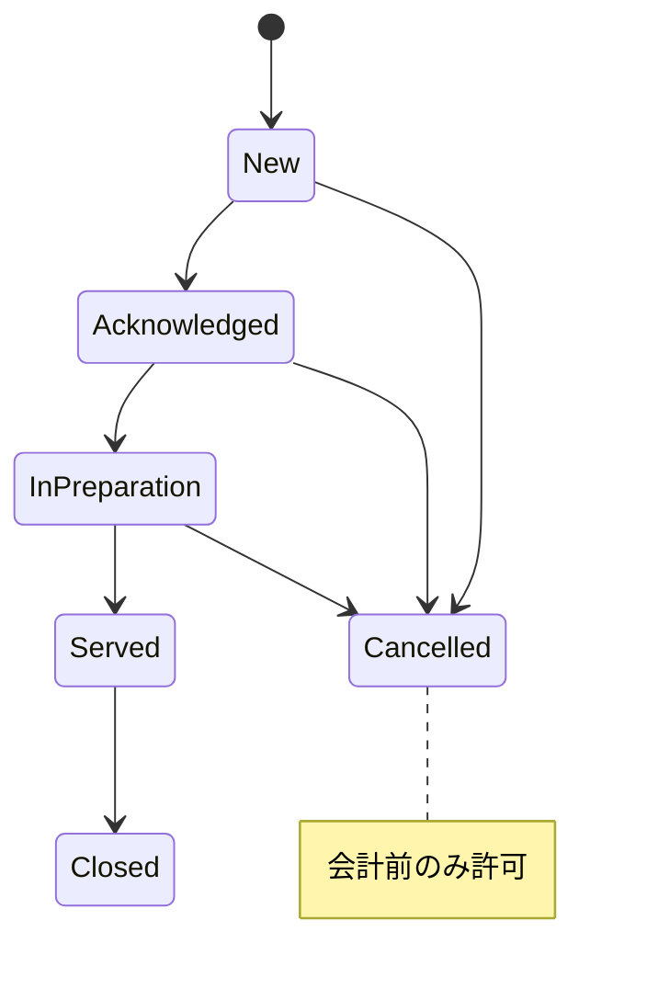

# QRオーダー & 会計連携システム 要件定義  
*対象店舗：ガールズバー*  
*主要技術：Supabase (PostgreSQL + Auth) / Next.js (App Router) / スマレジ連携*  

---

## 1. 目的・ゴール
- **来店客が卓上QRからスマホでメニューを閲覧・注文し、会計はスマレジで実施**  
- **スタッフドリンク・チャージ・席移動**などガールズバー特有の運用を網羅  
- **管理者・キャスト用コンソールを分離**し、セキュアかつ拡張性の高い基盤を構築  

---

## 2. アクターとロール

| ロール | デバイス | 主な権限 |
| :-- | :-- | :-- |
| **来店客 (QR)** | 客のスマホ | メニュー閲覧／注文／取消／会計 |
| **キャスト** | 店舗タブレット・BYOD | 自卓優先表示・他卓閲覧／注文入力／ステータス更新／会計 |
| **管理者** | PC・タブレット | 全卓操作／席設定／チャージ切替／メニュー同期／帳票閲覧 |

---

## 3. 機能要件

### 3.1 メニュー管理
| ID | 内容 | 備考 |
| :- | :- | :- |
| FR-01 | **スマレジ⇒メニュー同期ボタン** | 管理画面。押下時に全メニュー上書き同期 |
| FR-02 | メニューの一時非表示・価格変更 | QR側のみ反映（スマレジには送信しない） |
| FR-03 | スタッフドリンク指定 | 注文ごとに「奢るキャスト」を1名以上選択可 |

### 3.2 席・テーブル管理
| ID | 内容 |
| :- | :- |
| FR-10 | テーブル／席種（通常・VIP）CRUD（管理画面） |
| FR-11 | 席移動履歴保持（通常↔VIP） |
| FR-12 | 着席時に客が人数・指名有無を入力 |

### 3.3 チャージロジック
- **席種ごと単価設定**  
- **30分単位切り上げ**  
  - 0–30 min → 30 min課金  
  - 31–60 min → 60 min課金 …  
- **キャスト着席判定フラグ**  
  - 初期 OFF（課金停止）  
  - 管理者がONにした時刻から課金開始  

### 3.4 注文フロー & ステータス

- 変更権限：キャスト／管理者  
- 通知なし。リアルタイム更新は Supabase Realtime で実装  

### 3.5 注文取消
| 条件 | 動作 |
| :- | :- |
| **スマレジ連携前** | 管理者が取消可（在庫・売上ロールバック） |
| **連携後** | 取消不可（返金はスマレジ側で実施） |

### 3.6 会計 & スマレジ連携
| ID | 内容 | 詳細 |
| :- | :- | :- |
| FR-30 | 会計トリガ | 客／キャスト／管理者がテーブル単位で実行 |
| FR-31 | スマレジ送信 | 注文明細 + チャージ行を `POST /sales` |
| FR-32 | 決済後ロック | 注文・チャージ編集不可 |

### 3.7 レポート
| 期間 | 指標 |
| :- | :- |
| 日次・月次 | キャスト別：スタッフドリンク杯数／売上 店舗全体：総売上・来店人数・平均客単価 |

---

## 4. 非機能要件

| 区分 | 要件 |
| :-- | :-- |
| **性能** | 同時 50 接続でレスポンス < 300 ms |
| **可用性** | 99.9 %（営業時間内） |
| **PWA** | オフライン時：メニュー閲覧・再接続時自動送信 |
| **セキュリティ** | Supabase RLS + JWT、HTTPS、OWASP Top 10 対策 |
| **監査ログ** | 注文／取消／会計／席移動を 90 日以上保持 |
| **拡張性** | 多店舗対応、出退勤連携を後付け可能 |

---

## 5. データモデル概要

| テーブル | 主キー | 主なカラム | 備考 |
| :-- | :-- | :-- | :-- |
| `tables` | `table_id` | `name`, `seat_type`, `is_active` | `seat_type` = enum(normal, vip) |
| `sessions` | `session_id` | `table_id`, `start_at`, `end_at`, `headcount`, `has_cast`, `charge_started_at` | 1 着席 = 1 レコード |
| `orders` | `order_id` | `session_id`, `status`, `created_by_role` | |
| `order_items` | `item_id` | `order_id`, `menu_id`, `qty`, `unit_price`, `target_cast_id` | キャストドリンク時に使用 |
| `casts` | `cast_id` | `name`, `is_active` | 出退勤は将来拡張 |
| `charges` | `charge_id` | `session_id`, `minutes`, `seat_type`, `amount` | 30 min単位で自動生成 |
| `sales_closure` | `closure_id` | `period_type`, `period_date`, `totals(jsonb)` | 集計結果保持 |

---

## 6. 画面一覧

| 画面 | ロール | 主な機能 |
| :-- | :-- | :-- |
| QRメニュー | 来店客 | メニュー閲覧／注文／取消／会計 |
| キャスト卓リスト | キャスト | 自卓優先表示・注文入力・ステータス更新 |
| 管理ダッシュボード | 管理者 | 全卓状況・席移動・チャージ切替・取消 |
| テーブル設定 | 管理者 | 席／席種の追加・編集 |
| メニュー同期 | 管理者 | スマレジ同期ボタン |
| レポート | 管理者 | 日次／月次売上・スタッフドリンク集計 |

---

## 7. 外部連携（スマレジ）

| 項目 | 仕様 |
| :-- | :-- |
| 認証 | OAuth 2.0（Client ID / Secret） |
| メニュー同期 | `GET /products` → `menus` テーブルへ上書き |
| 会計連携 | `POST /sales` 注文明細 + チャージ行 |
| エラー処理 | 失敗時リトライ 3 回 → 管理画面にエラー表示 |

---

## 8. 将来拡張候補
- キャスト出退勤連携（シフト管理API or 手動）  
- LINE / Kitchen Display 連携  
- 割引・サービス料プラグイン化  
- オフライン決済キュー（ネット断時ローカル保存）  

---

## 9. 参考マイルストーン

| フェーズ | 主成果物 | 期間目安 |
| :-- | :-- | :-- |
| 要件確定 | 本ドキュメント | 0.5 M |
| 基盤実装 | Supabase スキーマ／Next.js PWA 骨格 | 1.0 M |
| 核心機能 | QR注文・チャージ計算・スマレジ連携 | 1.5 M |
| 管理UI & レポート | ダッシュボード／集計 | 1.0 M |
| テスト & 導入 | UAT → 本番運用 | 0.5 M |

---

**以上、ご確認ください。**